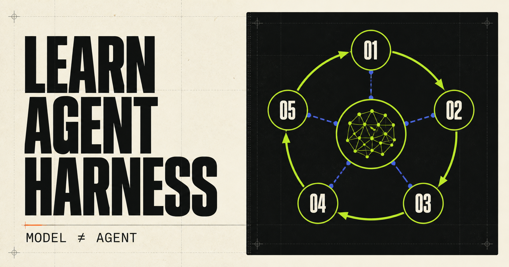

# Inside Coding Agents

> A visual, evidence-backed handbook and reproducible lab for coding agent architecture and agent harness engineering.

**English** | [简体中文](README.zh-CN.md)

[Open the live website](https://vpromise.github.io/inside-coding-agents/)

[](https://github.com/vpromise/inside-coding-agents/actions/workflows/ci.yml)
[](LICENSE)
[](curriculum/README.md)
[](apps/web/README.md)



Inside Coding Agents is an open-source, bilingual textbook, architecture atlas, and laboratory for understanding **coding agents** and the **agent harness** around an LLM. It turns agent loops, tool calling, context management, workspace access, instruction discovery, sandboxing, permissions, subagents, protocols, extensions, retries, and traces into runnable lessons and inspectable evidence.

Study how systems such as **Codex, Claude Code, Pi, and Reasonix** approach shared engineering problems. Then run the provider-neutral reference harness and reproduce the same concepts without an API key.

> This is an independent educational and research project. Product names belong to their respective owners; inclusion does not imply affiliation or endorsement.

## Why this project exists

A model can propose the next action. A useful coding agent still needs a system that owns state, exposes tools, applies policy, manages context, observes effects, and decides when the task is finished.

Most resources explain one product or show one toy loop. Inside Coding Agents connects three levels in one content graph:

- **Learn it:** small, deterministic Python lessons build a harness mechanism by mechanism.
- **Inspect it:** versioned Agent snapshots separate verified facts from interpretation.
- **Reproduce it:** controlled experiments publish fixtures, normalized traces, results, and failure boundaries.

The same material is useful as a beginner's coding-agent tutorial, an engineer's architecture reference, and a researcher's evidence index.

## Explore the project

| View | What it answers | Start here |
| --- | --- | --- |
| Academy | How do I build a coding agent from zero? | [Run the nine lessons](curriculum/README.md) |
| Mechanisms | What design problems do all agent harnesses share? | [Browse 16 mechanisms](content/mechanisms/README.md) |
| Agent Atlas | How does a specific agent implement those mechanisms? | [Inspect versioned profiles](content/agents/README.md) |
| Experiment Lab | Which observations can be reproduced under fixed conditions? | [Replay the controlled baseline](labs/README.md) |
| Registry | Where are claims, evidence, schemas, and stable IDs stored? | [Read the data model](registry/README.md) |
| Web | How does the shared graph become a bilingual, searchable site? | [Run the interface](apps/web/README.md) |

### Included in the v0.1 public preview

- 9 runnable bilingual long-form tutorials, each with a byte-verified Golden Trace, mental models, guided implementation, failure modes, exercises, production boundaries, and complete source code;
- 16 cross-agent mechanism records;
- 5 Agent profiles, 9 immutable snapshots, and 30 reviewed claims;
- pinned public-source maps for Codex, Pi, and Reasonix;
- a clean-room, official-document snapshot for Claude Code;
- 1 controlled experiment, 2 reproduced traces, and a structured result;
- a bilingual, searchable website with generic data-driven routes;
- JSON Schema, graph, digest, trace, link, safety, and web-build validation.

## Quick start

The lessons and controlled experiment are deterministic and require no model account or API key. Python 3.12+ and Node.js 22.13+ match CI.

```bash
git clone https://github.com/vpromise/inside-coding-agents.git
cd inside-coding-agents

python3 -m venv .venv
source .venv/bin/activate
python -m pip install -r requirements-dev.txt

# Build the smallest agent loop and print its Trace 0.1 events.
python -m curriculum.lessons.s01_agent_loop.demo

# Check the committed experiment without modifying files.
python labs/runner.py reference-tool-roundtrip-v1 --check

# Validate schemas, evidence links, graph references, digests, and traces.
python scripts/validate_registry.py
```

Run the interactive site:

```bash
cd apps/web
npm ci
npm run dev
```

Run the complete local quality gate:

```bash
python -m unittest discover -s scripts/tests -v
python -m unittest discover -s curriculum/tests -v
python -m unittest discover -s labs/tests -v
python labs/runner.py reference-tool-roundtrip-v1 --check
python scripts/validate_registry.py

cd apps/web
npm run audit:ci
npm run lint
npm run typecheck
npm test
```

## Agent coverage

The Atlas is a versioned evidence index, not a popularity ranking or benchmark leaderboard.

| Agent | Evidence surface | Snapshots | Reviewed claims |
| --- | --- | ---: | ---: |
| Claude Code | Official documentation; clean-room boundary | 1 | 3 |
| Codex | Pinned public source and official documentation | 3 | 9 |
| Pi | Pinned public source | 2 | 8 |
| Reasonix | Pinned public source | 2 | 9 |
| Reference Harness | Repository source and controlled reproduction | 1 | 1 |

Every architecture claim is attached to an Agent snapshot and one or more evidence records:

- `source` — a public source location pinned to a commit;
- `official-doc` — first-party product or project documentation;
- `reproduced` — an observation from a fixed, inspectable experiment;
- `inference` — an explicitly labeled interpretation with stated uncertainty.

Closed-source behavior is never presented as an internal implementation fact. Model quality, product defaults, and harness design are kept separate wherever the evidence allows it.

## How the knowledge graph works

```text
Mechanism
  ├── Lessons and runnable reference code
  ├── Agent implementations and versioned snapshots
  ├── Atomic claims and public evidence
  ├── Experiments, results, and normalized traces
  └── Bilingual pages and search entries
```

Stable IDs connect the graph. The Registry is the fact layer; Markdown is the narrative layer; the website is a generated view. Adding a conforming Agent, Claim, Mechanism, or Experiment should not require a product-specific page component.

## Repository map

```text
apps/web/                 Bilingual searchable web interface
content/agents/           Agent overviews and snapshot analyses
content/mechanisms/       Long-form mechanism explanations
curriculum/               Runnable lessons and reference harness
labs/                     Fixtures, scenarios, runner, traces, results
packages/trace-schema/    Shared Trace 0.1 contract
registry/                 Schemas, profiles, claims, mechanisms, experiments
scripts/                  Validation and publication-safety gates
```

Internal planning, private research checkouts, deployment bindings, credentials, and unredacted traces are intentionally not part of this public repository.

## Frequently asked questions

### What is an agent harness?

An agent harness is the system around a model that manages the control loop, messages, tools, state, context, execution policy, workspace effects, observability, and completion. The model is an important component, but it is not the whole agent.

### Is this a framework for running production agents?

Not currently. The reference harness is deliberately small and deterministic so mechanisms stay readable. It is teaching and experiment infrastructure, not a claim of production readiness.

### Is this a benchmark comparing Codex and Claude Code?

No. The current lab validates the research pipeline with a controlled reference harness. Cross-product results are published only when subjects, versions, permissions, environments, and observability boundaries are genuinely comparable.

### Can I add another coding agent?

Yes. Start with a versioned profile, attach atomic claims to public evidence, state closed-source and inference boundaries, and add a reproducible experiment only when one is justified. See [CONTRIBUTING.md](CONTRIBUTING.md).

## Contributing and security

Corrections with stronger evidence, independent reproductions, new mechanisms, runnable lessons, accessibility improvements, and technically reviewed translations are welcome. Read the [contribution guide](CONTRIBUTING.md) before opening a pull request.

Do not publish credentials, private source, personal data, unredacted native traces, or exploitable security details. Report vulnerabilities through the private process in [SECURITY.md](SECURITY.md).

## License and attribution

The repository is licensed under [Apache License 2.0](LICENSE). Upstream source excerpts are not vendored; external claims link to their original public evidence.

The progressive, build-it-yourself teaching style was inspired in part by [shareAI-lab/learn-claude-code](https://github.com/shareAI-lab/learn-claude-code). Inside Coding Agents broadens that idea into a product-neutral atlas, content graph, and reproducible lab.
